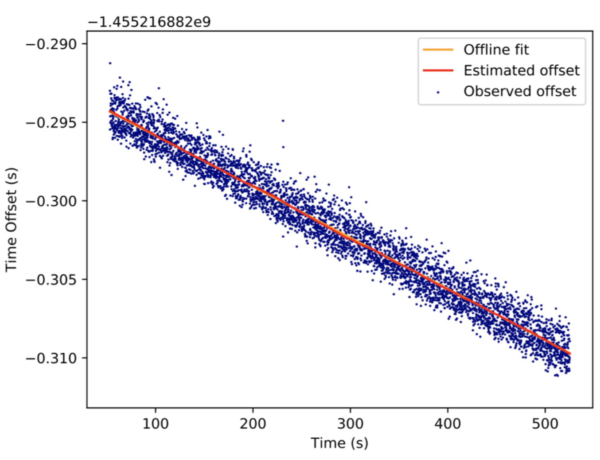

# Time Synchronization Protocol v1

This protocol is used to estimate the time offsets between system clocks on two MAVLink systems, in a two-system MAVLink network.
This is useful because it allows ....

The protocol uses just one message [TIMESYNC](#TIMESYNC), which has two `int64_t` fields, `tc1` and `ts1`. 
The message is sent out with a nanosecond timestamp in `ts1` (current unix timestamp *1e9).
This is mirrored back by the remote system, along with its own timestamp.
The first system can then determine the round-trip time, and estimate the timestamp offset.
This sequence is run multiple times to remove the transient channel and processor usage from the offset calculation.

The protocol only works when there are only two systems on the MAVLink network.
This is because [TIMESYNC](#TIMESYNC) is broadcast (cannot be addressed to a single node), so multiple components on the network may respond.
A recipient has no way to reliably determine if the timestamp in `ts1` is the one it sent out, or is a reply to another system.

## Message/Enum Summary

Message | Description
-- | --
[TIMESYNC](../messages/common.md#TIMESYNC) | Time synchronisation message.

## Sequences

The sequence is:
1. The first system, which needs time synchronisation, broadcasts `TIMESYNC` with `tc1 = 0`, and `ts1 = timestamp "now" * 1000`.
1. The second system receives the message with `TIMESYNC.tc1 == 0`, and hence knows it is a`TIMESYNC` request from another system.
   It responds with the first system's timestamp mirrored back in `ts1`, and its own timestamp in `tc1` (`timestamp "now" * 1000`).
1. When the first (original) system gets a message with `tc1 ≠ 0` it knows this is a reply to its message (and not a new sync request).
   From the message the system can:
   - determine the round trip time (by comparing its current timestamp with the original stamp that was returned in the message in `tc1`).
   - estimate the offset between system timestamps, using the round trip time and the timestamp sent back by the remote system.

The offset is an estimate because the time spent, both inbound and outbound, will change over time based on things like link congestion and processing time.
Therefore the above sequence might be run a significant number of times, and filtering used to remove outlying estimates.

A graph showing the "noise" when estimating the offset is given below (from PX4).

## Implementations

- PX4: [/src/modules/mavlink/mavlink_timesync.cpp](https://github.com/PX4/PX4-Autopilot/blob/master/src/modules/mavlink/mavlink_timesync.cpp)
